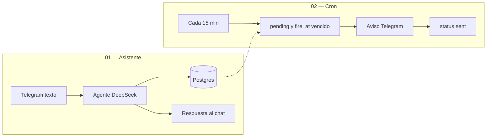

# Sistema de seguimientos — arquitectura v1

Un vendedor escribe en Telegram (solo texto) y el asistente crea seguimientos en Postgres. El aviso real sale en el mismo chat, a las 10:00 hora Venezuela: 3 días antes y el día. No hay calendario ni app propia: orquesta n8n en un VPS.

Estado actual: chat y cron funcionando. Este documento describe lo que hay hoy, no un roadmap.

## Quick path

1. El vendedor manda un mensaje de texto al bot.
2. El agente confirma nombre, teléfono y fecha (`YYYY-MM-DD`) y llama `crear_seguimiento`.
3. Postgres guarda **dos filas**: `t3` (fecha − 3 días, 10:00 Caracas) y `day` (la fecha, 10:00 Caracas).
4. Cada 15 minutos el cron busca `pending` con `fire_at <= now()`, envía Telegram y marca `sent`.

Si `fire_at` ya pasó al crear, esa fila nace `skipped` y el cron no la manda.

## Stack que se usa ahora

| Pieza | Rol |
|-------|-----|
| **n8n** (VPS, HTTPS público) | Orquestación. Telegram no llega a localhost. |
| **Telegram Bot API** | Canal: trigger de mensajes + envío de respuestas y avisos. |
| **PostgreSQL** | Fuente de verdad: avisos, memoria corta, resumen durable. |
| **DeepSeek API** (`deepseek-v4-flash`) | LLM del chat y del compactado. API directa, no OpenRouter. |
| **LangChain en n8n** | Nodo Agent + Chat Memory + Chain LLM. |

Credenciales en n8n (no en el repo): Telegram, Postgres y DeepSeek. Los JSON del repo llevan placeholders `PEGAR_CRED_*`.

## Dos workflows, dos responsabilidades

| Workflow | Archivo | Qué hace | LLM |
|----------|---------|----------|-----|
| Seguimientos: asistente Telegram | `n8n/01-telegram-asistente-seguimientos.json` | Recibe chat, decide, escribe en Postgres, responde | Sí |
| Seguimientos: cron avisos Telegram | `n8n/02-cron-recordatorios.json` | Dispara avisos vencidos | No |

Zona horaria de ambos: `America/Caracas`.

El cron **no** se dispara por un mensaje. Solo lee filas. El chat **no** envía el aviso de las 10:00; solo las programa.

## Flujo 01 — chat

Camino feliz:

Telegram Trigger → ¿hay texto y no es bot? → Config → Cargar resumen → Preparar input → Agente → Responder Telegram → Contar memoria → compactar si hay más de 20 filas.

| Nodo / pieza | Qué decide |
|--------------|------------|
| Config | Timezone, hora 10, T-3, ventana 10, compactar a 20, allowlist opcional de `chat.id`. |
| Preparar input | System prompt con hoy/año Venezuela, reglas de fecha y el resumen durable. |
| Agente | Hasta 8 iteraciones. Modelo `deepseek-v4-flash`, temperatura 0.2. |
| Postgres Chat Memory | Últimas 10 interacciones, `session_id` = `chat.id`. |
| Responder Telegram | Manda `$json.output` al mismo chat. |

Mensajes sin texto (stickers, fotos) y mensajes de bots se descartan. Si `allowedChatIds` tiene valores, el resto no entra al agente.

### Tools del agente

Son `n8n-nodes-base.postgresTool` v2.6 (no el nodo Postgres del camino lineal). Si se importan como Postgres normal, n8n las deja sueltas y el agente no las ve.

| Tool | Quién fija el SQL | Qué hace el modelo |
|------|-------------------|--------------------|
| `crear_seguimiento` | SQL fijo: inserta `t3` + `day` a las 10:00 Caracas | Solo `client_name`, `client_phone`, `estimated_date` |
| `listar_seguimientos` | SQL fijo filtrado por este `chat.id` | Nada: lista `pending` y `skipped` |
| `cancelar_seguimiento` | SQL fijo: `pending` → `cancelled` | Nombre (≥3 letras) o teléfono |

El `telegram_chat_id` **nunca** lo elige el LLM: sale del trigger. Teléfono se normaliza (dígitos y `+`). Unique `(telegram_chat_id, client_phone, estimated_date, kind)`. Un `sent` no se pisa en conflicto.

Reglas de fecha (inyectadas cada mensaje):

- Rango (`28/08 al 30/08`) → **primera** fecha.
- Día/mes sin año → año vigente en Venezuela.
- Formato a la tool: `YYYY-MM-DD`.
- Pedir confirmación explícita antes de crear.

## Flujo 02 — cron

Cada 15 min:

1. `SELECT` filas `pending` con `fire_at <= now()`.
2. Telegram: T-3 o “seguimiento HOY”, con cliente, teléfono y fecha.
3. `UPDATE` a `sent` usando el `id` del SELECT (`$('Avisos vencidos')`), no el output de Telegram (ese nodo pierde el id).

Antes de las 10:00 no hay avisos del día, aunque el cron ya haya corrido.

## Datos

Definidos en `n8n/schema.sql`.

| Tabla | Para qué |
|-------|----------|
| `followup_reminders` | Avisos. Estados: `pending`, `sent`, `cancelled`, `skipped`. |
| `assistant_chat_messages` | Memoria corta del nodo Postgres Chat Memory. |
| `conversation_summaries` | Resumen durable (≤800 caracteres) cuando se compacta. |

Memoria en dos capas:

1. Ventana de 10 interacciones en el agente.
2. Si hay más de 20 filas, DeepSeek resume lo viejo, se guarda en `conversation_summaries` y se borran las filas fuera de las 20 más nuevas. El resumen entra al system prompt del siguiente mensaje.

## Decisiones que importan

| Tema | Decisión |
|------|----------|
| Aviso real | Telegram, no Google Calendar. |
| LLM | DeepSeek directo (`deepseek-v4-flash`). Compactar usa el mismo modelo. |
| Cálculo de horas | SQL en Postgres, no el modelo. |
| Fechas pasadas al crear | `skipped`, no se envían. |
| Alcance del chat | Solo seguimientos. No inventa clientes ni fechas. |
| Dominio | Proyecto nuevo. No Fibralan, Drive ni Tinify. |

Gotcha conocido: si al usar tools aparece `reasoning_content must be passed back`, el thinking de V4 está prendido. Apagar thinking o usar el nodo OpenAI Chat Model con `https://api.deepseek.com` y la misma key.

## Archivos del repo

| Ruta | Contenido |
|------|-----------|
| `n8n/schema.sql` | Tablas e índices |
| `n8n/01-telegram-asistente-seguimientos.json` | Chat + agente + tools |
| `n8n/02-cron-recordatorios.json` | Cron de avisos |
| `n8n/README.md` | Cómo importar y mapear credenciales |

## Checklist

- [ ] Entiendo que hay dos workflows y que el cron no se dispara por chat.
- [ ] Sé qué stack corre hoy: n8n, Telegram, Postgres, DeepSeek v4-flash.
- [ ] Sé las tres tools: crear, listar, cancelar — y que el `chat.id` no lo decide el LLM.
- [ ] Sé que un seguimiento son dos avisos a las 10:00 Caracas (`t3` y `day`).
- [ ] Sé que la memoria corta son 10 turnos y el resto vive en un resumen de 800 caracteres.

## Next step

Operación e importación: [`n8n/README.md`](../n8n/README.md).
