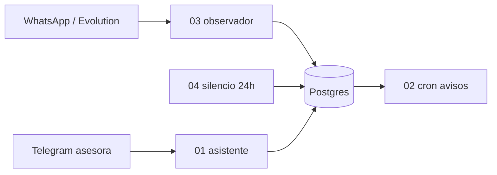

# Sistema de seguimientos — arquitectura v2

Un vendedor escribe en Telegram. El asistente crea avisos y ahora también **lee el embudo de WhatsApp**. Evolution manda los chats a n8n; el flujo 03 **observa y clasifica**, no responde al huésped. El aviso de seguimiento sigue saliendo en Telegram a las 10:00 Venezuela.

## Quick path

1. El cliente escribe por WhatsApp (Evolution `messages.upsert`).
2. El 03 guarda el mensaje, filtra relevancia y actualiza scores/etapa en `leads`.
3. Si hay cotización y el cliente calla >24 h, el 04 pasa a `pregunto_no_concreto` o `no_respondio`.
4. En Telegram, Evelin pregunta listas o estadísticas; el 01 consulta esas tablas (no inventa filas).
5. Los seguimientos T-3 / día siguen igual: 01 crea filas, 02 las dispara.

## Stack

| Pieza | Rol |
|-------|-----|
| **n8n** (VPS, HTTPS) | Orquestación |
| **Telegram Bot API** | Canal del asistente y de los avisos 10:00 |
| **Evolution API** | Entrada de WhatsApp (ya conectada por el cliente) |
| **PostgreSQL** | Avisos, memoria del bot, leads y mensajes |
| **DeepSeek** (`deepseek-v4-flash`) | Chat Telegram, filtro y clasificación de etapa |

## Cuatro workflows

| Workflow | Archivo | LLM | Habla con el cliente WA |
|----------|---------|-----|-------------------------|
| Asistente Telegram | `01-…json` | Sí | No |
| Cron avisos | `02-…json` | No | No |
| Clasificar leads | `03-…json` | Sí | **No** |
| Cron silencio | `04-…json` | No | No |

El 03 no es el bot de e-commerce del `example/analizador_sentimiento.json`. Reutiliza el patrón (webhook Evolution + Text Classifier) con dominio de **hospedaje**.

## Embudo WhatsApp

Tres casos reales de referencia:

| Etapa | Qué es |
|-------|--------|
| `concreto` | Reservó: “para reservar”, formulario con cédula, apartar, abonar, pagar |
| `pregunto_no_concreto` | Preguntó mucho post-cotización y no cerró |
| `no_respondio` | Recibió cotización/formulario y casi no volvió |
| `en_proceso` | Todavía activo |

Scores 0–100 en `leads`: `score_cierre`, `score_engagement`, `score_silencio`, `score_potencial` (difusión si hay interés y **no** reservó).

Reglas fijas encima del LLM: señales de pago/reserva fuerzan `concreto`; un `concreto` no se pisa; si el cliente acaba de escribir no puede quedar `no_respondio`.

### Camino del 03

Webhook → Normalizar (ignora grupos y status) → upsert `leads` → inserta mensaje (idempotente) → si es la asesora, solo guarda (detecta cotización) → si es cliente con texto → historial 20 msgs → **Text Classifier** → si `relevante`, DeepSeek etapa + reglas → `lead_score_events`.

## Datos

| Tabla | Para qué |
|-------|----------|
| `followup_reminders` | Avisos T-3 y día |
| `assistant_chat_messages` / `conversation_summaries` | Memoria del bot Telegram |
| `leads` | Un WhatsApp = un lead (etapa + scores) |
| `whatsapp_messages` | Historial (incluye `from_me`) |
| `lead_score_events` | Auditoría de cada clasificación o silencio |

## Tools del asistente

Postgres Tool v2.6. El `chat.id` de Telegram no lo elige el LLM. Las listas de leads salen de SQL fijo.

| Tool | Pregunta típica |
|------|-----------------|
| `crear_seguimiento` | Crear aviso |
| `listar_seguimientos` / `cancelar_seguimiento` | Pendientes |
| `listar_leads_potenciales` | “¿A quién le mando una difusión?” |
| `listar_preguntan_sin_reservar` | “Los que preguntan y no reservan” |
| `estadisticas_leads_mes` | “% de reservas de este mes” |

## Decisiones

| Tema | Decisión |
|------|----------|
| WhatsApp | Observador. La asesora sigue hablando. |
| Aviso 10:00 | Telegram, no Calendar. |
| Clasificación | Filtro de relevancia + etapa de embudo, no tags de e-commerce. |
| `concreto` | Regla por frases de reserva/pago, no solo sentimiento. |
| Secretos | Credenciales en n8n. JSON del repo: `PEGAR_CRED_*`. |

## Checklist

- [ ] El 03 no envía mensajes a WhatsApp.
- [ ] Evolution apunta al webhook `seguimientos-leads`.
- [ ] `schema.sql` v2 ya corrió (existen `leads` y `whatsapp_messages`).
- [ ] El 01 tiene las tres tools de leads como `postgresTool`.
- [ ] Un `concreto` no baja de etapa por silencio.

## Next step

Importación y Evolution: [`n8n/README.md`](../n8n/README.md).
