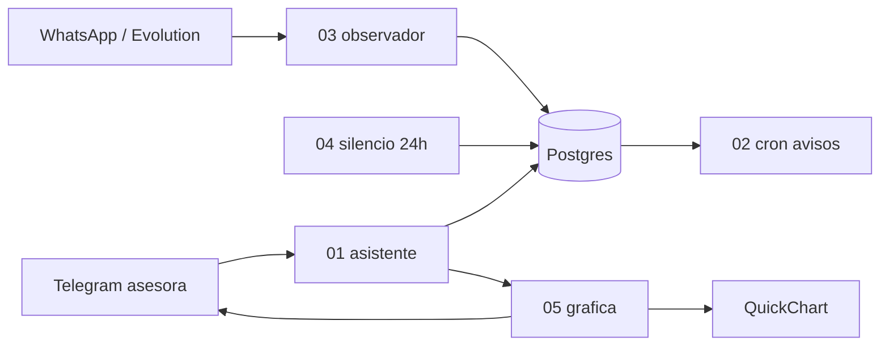

# Sistema de seguimientos — arquitectura v2

Un vendedor escribe en Telegram. El asistente crea avisos comerciales (T-3 y día a las 10:00) y **avisos de llegada** (16:00 y 20:00 el día del check-in). También **lee el embudo de WhatsApp**. Evolution manda los chats a n8n; el flujo 03 **observa y clasifica**, no responde al huésped.

## Quick path

1. El cliente escribe por WhatsApp (Evolution `messages.upsert`).
2. El 03 guarda el mensaje, filtra relevancia y actualiza scores/etapa en `leads`.
3. Si hay cotización y el cliente calla >24 h, el 04 pasa a `pregunto_no_concreto` o `no_respondio`.
4. En Telegram, Evelin pregunta listas o estadísticas; el 01 consulta esas tablas (no inventa filas).
5. Comercial T-3 / día a las 10:00, o llegada a las 16:00 y 20:00: el 01 crea filas, el 02 las dispara.
6. Si pide gráfica, el 01 llama al 05 (SQL → QuickChart → foto Telegram).

## Stack

| Pieza | Rol |
|-------|-----|
| **n8n** (VPS, HTTPS) | Orquestación |
| **Telegram Bot API** | Canal del asistente y de los avisos 10:00 / 16:00 / 20:00 |
| **Evolution API** | Entrada de WhatsApp (ya conectada por el cliente) |
| **PostgreSQL** | Avisos, memoria del bot, leads y mensajes |
| **DeepSeek** (`deepseek-v4-flash`) | Chat Telegram, filtro y clasificación de etapa |
| **QuickChart** (`ianw/quickchart`) | PNG de barras para reportes en Telegram |

## Cinco workflows

```mermaid
flowchart LR
  WA[WhatsApp / Evolution] --> WF3[03 observador]
  WF3 --> PG[(Postgres)]
  WF4[04 silencio 24h] --> PG
  TG[Telegram asesora] --> WF1[01 asistente]
  WF1 --> PG
  WF1 --> WF5[05 grafica]
  WF5 --> QC[QuickChart]
  WF5 --> TG
  PG --> WF2[02 cron avisos]
```

| Workflow | Archivo | LLM | Habla con el cliente WA |
|----------|---------|-----|-------------------------|
| Asistente Telegram | `01-…json` | Sí | No |
| Cron avisos | `02-…json` | No | No |
| Clasificar leads | `03-…json` | Sí | **No** |
| Cron silencio | `04-…json` | No | No |
| Gráfica reportes | `05-…json` | No | No (foto a la asesora) |

El 03 no es el bot de e-commerce del `example/analizador_sentimiento.json`. Reutiliza el patrón (webhook Evolution + Text Classifier) con dominio de **hospedaje**.

## Embudo WhatsApp

Tres casos reales de referencia:

| Etapa | Qué es |
|-------|--------|
| `concreto` | Reservó: “para reservar”, formulario con cédula, apartar, abonar, pagar |
| `pregunto_no_concreto` | Preguntó mucho post-cotización y no cerró |
| `no_respondio` | Recibió cotización/formulario y casi no volvió |
| `en_proceso` | Todavía activo |

Scores 0–100 en `leads`: `score_cierre`, `score_engagement`, `score_silencio`, `score_potencial` (difusión si hay interés y **no** reservó).

Reglas fijas encima del LLM: señales de pago/reserva fuerzan `concreto`; un `concreto` no se pisa; si el cliente acaba de escribir no puede quedar `no_respondio`.

### Camino del 03

Webhook → Normalizar (ignora grupos y status) → upsert `leads` → inserta mensaje (idempotente) → si es la asesora, solo guarda (detecta cotización) → si es cliente con texto → historial 20 msgs → **Text Classifier** → si `relevante`, DeepSeek etapa + reglas → `lead_score_events`.

## Datos

| Tabla | Para qué |
|-------|----------|
| `followup_reminders` | Avisos comerciales (t3, day) y de llegada (arrival_16, arrival_20) |
| `assistant_chat_messages` / `conversation_summaries` | Memoria del bot Telegram |
| `leads` | Un WhatsApp = un lead (etapa + scores) |
| `whatsapp_messages` | Historial (incluye `from_me`) |
| `lead_score_events` | Auditoría de cada clasificación o silencio |

## Tools del asistente

Postgres Tool v2.6. El `chat.id` de Telegram no lo elige el LLM. Las listas de leads salen de SQL fijo.

| Tool | Pregunta típica |
|------|-----------------|
| `crear_seguimiento` | Aviso comercial T-3 + día, 10:00 |
| `crear_seguimiento_llegada` | Check-in: 16:00 y 20:00 el mismo día |
| `listar_seguimientos` | Pendientes (distingue comercial vs llegada) |
| `cancelar_seguimiento` | Cancela; `tipo`: llegada, comercial o todos |
| `listar_leads_potenciales` | “¿A quién le mando una difusión?” |
| `listar_preguntan_sin_reservar` | “Los que preguntan y no reservan” |
| `estadisticas_leads_mes` | “% de reservas de este mes” |
| `listar_leads_reporte` | Listado por nombre del mes |
| `enviar_grafica` | PNG al chat: `embudo_mes` o `reservas_dia` (flujo 05) |

Si menciona **llegada** / check-in, el 01 llama `crear_seguimiento_llegada` (no el comercial). Cancelar pasa `tipo` para no borrar el otro producto del mismo cliente. Si pide **gráfica**, el 01 llama `enviar_grafica`; el 05 pinta y manda la foto. Los nombres siguen en `listar_leads_reporte`.

## Decisiones

| Tema | Decisión |
|------|----------|
| WhatsApp | Observador. La asesora sigue hablando. |
| Aviso comercial 10:00 | Telegram, no Calendar. T-3 y día. |
| Aviso de llegada | El día del check-in, 16:00 y 20:00 Venezuela. Lo configura Evelin; no sale del 03. |
| Cancelar | Filtro `tipo` (llegada / comercial / todos) para no borrar el otro producto. |
| Clasificación | Filtro de relevancia + etapa de embudo, no tags de e-commerce. |
| `concreto` | Regla por frases de reserva/pago, no solo sentimiento. |
| Gráfica | Subflujo 05 + QuickChart. El 01 no pega PNG en sendMessage. |
| Secretos | Credenciales en n8n. JSON del repo: `PEGAR_CRED_*`. |

## Producción

| Recurso | URL |
|---------|-----|
| Bot Telegram | https://t.me/eve_leads_bot |
| Webhook Evolution | https://demo-n8n.hiti0l.easypanel.host/webhook/seguimientos-leads |
| Instancia n8n | https://demo-n8n.hiti0l.easypanel.host/ *(privada)* |
| Repositorio | https://github.com/fyarza/n8n-sistema-seguimiento |
| Video demo (YouTube) | https://youtu.be/Q20pbcjGBMI |

## Checklist

- [ ] El 03 no envía mensajes a WhatsApp.
- [ ] Evolution apunta al webhook `seguimientos-leads`.
- [ ] `schema.sql` v2 ya corrió (existen `leads` y `whatsapp_messages`).
- [ ] Se re-ejecutó `schema.sql` (ALTER de `kind`: `arrival_16`, `arrival_20`).
- [ ] El 01 tiene las tools de leads y `crear_seguimiento_llegada` como `postgresTool`.
- [ ] El 05 está activo y la tool `enviar_grafica` del 01 apunta a su ID (no `PEGAR_ID_WORKFLOW_05`).
- [ ] Un `concreto` no baja de etapa por silencio.
- [ ] Cancelar una llegada no borra el T-3 comercial del mismo cliente.

## Next step

Importación y Evolution: [`n8n/README.md`](../n8n/README.md).
