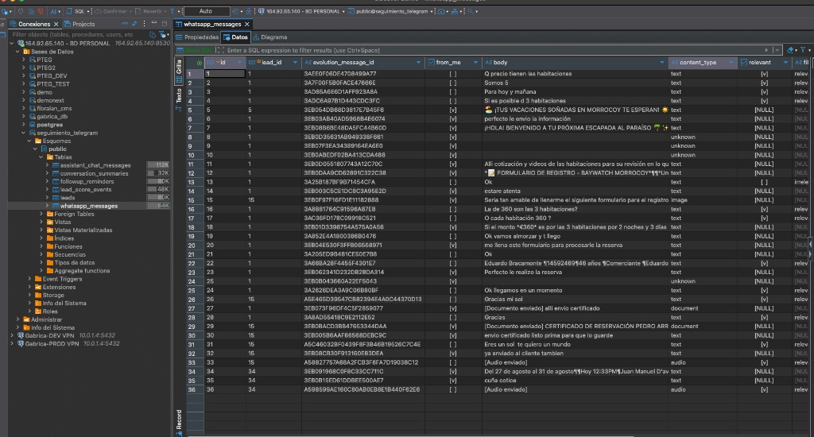
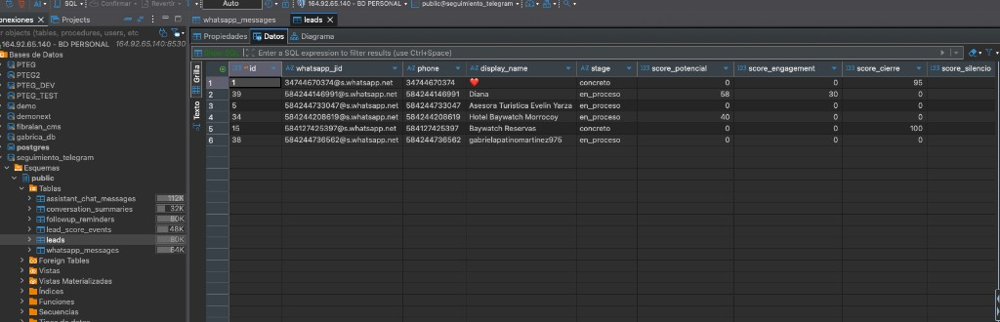
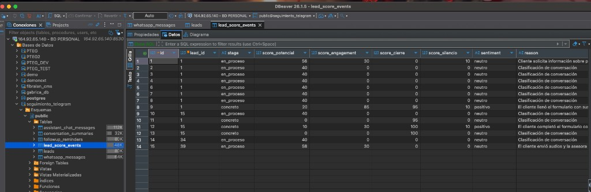
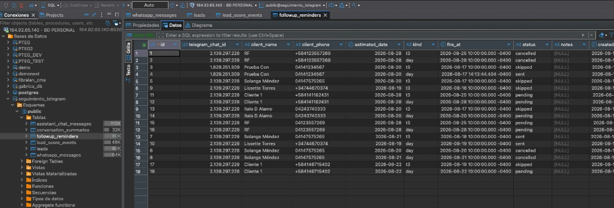

# Informe Final de Proyecto: n8n — sistema-seguimiento v2

**Programa:** Curso de Inteligencia Artificial Aplicada a Organizaciones — UTN-FRBA / EPIData — CETTLA

---

## RECURSOS OBLIGATORIOS DEL PROYECTO

> **Nota de arquitectura:** El proyecto no posee un frontend web tradicional. La evaluación se realiza mediante el bot de Telegram en producción, el webhook de Evolution API, el repositorio de código y la evidencia de datos persistidos en PostgreSQL. La instancia n8n es privada por seguridad; el docente puede verificar el funcionamiento a través del bot, los webhooks y las capturas de evidencia incluidas en este informe y en el repositorio.

| Recurso Obligatorio | URL / Identificador Directo |
|---------------------|----------------------------|
| Repositorio GitHub | https://github.com/fyarza/n8n-sistema-seguimiento |
| Bot de Telegram en producción | https://t.me/eve_leads_bot |
| Webhook Evolution API (WhatsApp) | https://demo-n8n.hiti0l.easypanel.host/webhook/seguimientos-leads |
| Instancia n8n (privada) | https://demo-n8n.hiti0l.easypanel.host/ *(acceso restringido; ver nota arriba)* |
| Video de Demostración (YouTube) | *Pendiente de publicación* |
| Evidencia en repositorio | `docs/evidencia/` (capturas DBeaver de tablas en producción) |

---

# PARTE 1 — El Proyecto como Aplicación Real

## Sección 1: Presentación del Equipo y del Proyecto

### Integrantes del grupo

- **Federico Yarza:** Único participante y desarrollador. Responsable del planteamiento del problema de negocio, diseño de la arquitectura n8n v2, integración WhatsApp (Evolution API) + Telegram, configuración del agente LLM (DeepSeek), diseño del esquema PostgreSQL, implementación de los cuatro workflows, tools parametrizadas, documentación técnica y despliegue en producción.

### Nombre del proyecto

**n8n — sistema-seguimiento v2** (Bot de Telegram + Observador WhatsApp para Gestión de Seguimientos Comerciales y Embudo de Leads en Turismo/Hospedaje).

### Problema que resuelve

En la gestión comercial de reservas hoteleras y servicios turísticos, los asesores enfrentan dos problemas simultáneos:

1. **Seguimiento poscotización:** Tras enviar una cotización por WhatsApp, pierden la ventana de oportunidad porque el seguimiento manual depende de recordatorios personales, calendarios o CRMs con alta fricción operativa durante la venta activa desde el móvil.

2. **Visibilidad del embudo:** Decenas de conversaciones de WhatsApp ocurren en paralelo, pero no existe una forma ágil de saber quién preguntó mucho y no reservó, quién quedó en silencio tras la cotización, o quién ya concretó — sin revisar chat por chat.

**n8n — sistema-seguimiento v2** resuelve ambos problemas mediante:

- Un **asistente conversacional en Telegram** ([@eve_leads_bot](https://t.me/eve_leads_bot)) que permite al asesor registrar, listar y cancelar seguimientos comerciales en lenguaje natural en menos de 10 segundos, con avisos automáticos a las 10:00 AM (hora Caracas/Venezuela) a los 3 días de la fecha estimada y el día exacto de cierre.

- Un **observador de WhatsApp** (Evolution API → n8n) que clasifica cada lead en etapas del embudo (`en_proceso`, `concreto`, `pregunto_no_concreto`, `no_respondio`), asigna scores de potencial, engagement, cierre y silencio, y detecta inactividad >24 horas post-cotización — **sin responder al huésped**, para que la asesora siga atendiendo con naturalidad.

### Público objetivo

Asesores comerciales y ejecutivos de cuenta en turismo y hospedaje que operan principalmente desde dispositivos móviles, gestionan ventas por WhatsApp y necesitan alertas de seguimiento y consultas rápidas del embudo sin interfaces complejas de CRM.

**Caso de uso de referencia:** operación comercial de **Hotel Casino Baywatch Morrocoy**, donde la asesora turística utiliza el bot de Telegram para programar avisos y consultar el estado de leads capturados automáticamente desde WhatsApp.

---

## Sección 2: Arquitectura Técnica

### 2.1 Flujo de Datos y Componentes del Sistema

El sistema se compone de **cuatro workflows n8n** orquestados sobre una base PostgreSQL compartida:

```
WhatsApp (Evolution API) ──► WF03 observador ──► PostgreSQL
                                    ▲
WF04 cron silencio (15 min) ────────┘

Telegram (asesora) ──► WF01 asistente ──► PostgreSQL
                              ▲
PostgreSQL ──► WF02 cron avisos (15 min) ──► Telegram
```

**Flujo de Entrada a Salida (Telegram):**
Mensaje de texto en Telegram → Trigger nativo de n8n → Carga del resumen durable acumulado + ventana de 10 mensajes → Agente LLM (DeepSeek) procesa intención y extrae entidades → Invocación de Postgres Tool parametrizada → Respuesta confirmatoria en Telegram.

**Flujo de Entrada a Salida (WhatsApp):**
Evento `messages.upsert` de Evolution API → Webhook POST `seguimientos-leads` → Normalización (ignora grupos y broadcasts) → Upsert de lead + insert idempotente de mensaje → Si es la asesora: solo guarda y detecta cotización → Si es el cliente con texto relevante: filtro DeepSeek + clasificación de etapa + reglas fijas → Actualización de scores y auditoría en `lead_score_events`.

**Componentes de IA vs. Lógica Tradicional:**

| Tipo | Componente | Rol |
|------|------------|-----|
| **IA** | Agente LLM DeepSeek (`deepseek-v4-flash`) en WF01 | Comprensión conversacional, extracción de entidades, invocación de 7 tools, compactación de memoria |
| **IA** | Filtro de relevancia + clasificador de etapa DeepSeek en WF03 | Decide si un mensaje del cliente es relevante para el embudo y asigna etapa inicial |
| **Lógica tradicional** | Cron cada 15 min (WF02, WF04) | Disparo de avisos vencidos y detección de silencio >24 h |
| **Lógica tradicional** | Allowlist por chat ID, reglas fijas de embudo | Seguridad de acceso y protección de etapa `concreto` |
| **Lógica tradicional** | SQL parametrizado con `$1…$n` | Persistencia segura sin SQL arbitrario del LLM |
| **Lógica tradicional** | Nodos HTTP Telegram | Envío de avisos formateados |

**Ubicación de la Memoria Persistente:**

| Tabla | Propósito |
|-------|-----------|
| `assistant_chat_messages` | Memoria corta del agente (10 interacciones) |
| `conversation_summaries` | Resumen consolidado durable por chat Telegram |
| `followup_reminders` | Avisos T-3 y día programados |
| `leads` | Embudo WhatsApp: etapa + 4 scores por lead |
| `whatsapp_messages` | Historial bidireccional con idempotencia Evolution |
| `lead_score_events` | Auditoría de cada clasificación o cambio por silencio |

### 2.2 Funcionamiento del Agente (WF01)

El sistema utiliza un ciclo de agente reactivo LangChain en n8n con hasta 8 iteraciones:

1. Recibe mensaje del usuario + resumen histórico consolidado + ventana de los últimos 10 mensajes.
2. Evalúa si requiere ejecutar una herramienta entre las 7 disponibles.
3. Normaliza parámetros (fechas informales → `YYYY-MM-DD`; rangos → primera fecha; año vigente Venezuela).
4. Ejecuta consulta SQL segura con `telegram_chat_id` inyectado desde el trigger (no elegible por el LLM).
5. Redacta confirmación estructurada para Telegram, incluyendo scores cuando consulta el embudo.
6. Al superar 20 mensajes guardados, activa subagente de compactación DeepSeek → máximo 800 caracteres en `conversation_summaries`.

**Tools del agente:**

| Tool | Función |
|------|---------|
| `crear_seguimiento` | Crea avisos `t3` + `day` a las 10:00 Caracas |
| `listar_seguimientos` | Pending/skipped del chat actual |
| `cancelar_seguimiento` | Por nombre (≥3 letras) o teléfono |
| `listar_leads_potenciales` | Difusión: potenciales con scores |
| `listar_preguntan_sin_reservar` | Alto engagement, bajo cierre |
| `estadisticas_leads_mes` | Conteos y % reservaciones por mes |
| `listar_leads_reporte` | Listado: concretaron / no_concretaron / atendidos |

### 2.3 Observador WhatsApp (WF03 + WF04)

- **WF03** no envía mensajes al cliente. Solo observa, persiste y clasifica.
- **WF04** corre cada 15 minutos: si un lead está `en_proceso`, recibió cotización, lleva >24 h sin respuesta del cliente y `score_cierre < 50`, pasa a `pregunto_no_concreto` (engagement alto) o `no_respondio` (engagement bajo). Nunca degrada un `concreto`.

**Etapas del embudo:**

| Etapa | Significado |
|-------|-------------|
| `en_proceso` | Conversación activa |
| `concreto` | Reservó / pagó / completó formulario |
| `pregunto_no_concreto` | Preguntó mucho post-cotización y no cerró |
| `no_respondio` | Recibió cotización y casi no volvió |

---

## Sección 3: Stack Tecnológico

| Componente | Tecnología / Herramienta | Por qué se eligió |
|------------|--------------------------|-------------------|
| Canal asesor | Telegram Bot API — [@eve_leads_bot](https://t.me/eve_leads_bot) | Consumo móvil inmediato, notificaciones push, cero fricción de instalación para el vendedor |
| Canal clientes | WhatsApp vía Evolution API | Canal real de ventas del negocio; el observador no interrumpe la atención humana |
| Backend / Orquestación | n8n en VPS Easypanel (HTTPS) | Webhooks públicos para Telegram y Evolution, agentes LangChain nativos, cron, credenciales cifradas |
| Base de Datos | PostgreSQL (`seguimiento_telegram`) | Persistencia relacional, zonas horarias (`America/Caracas`), constraints UNIQUE, tools SQL del agente |
| Modelo de IA (prod.) | DeepSeek API (`deepseek-v4-flash`) | Alta velocidad, bajo costo por token, buena precisión en function calling y fechas |
| Entorno de Desarrollo | Cursor IDE + MCP (Composio) | Refactorización asistida de JSON n8n, SQL parametrizado y documentación |

> **Nota:** La carpeta `example/` del repositorio contiene un prototipo legacy de e-commerce con Gemini. No forma parte del sistema en producción v2.

---

## Sección 4: Evidencia de Funcionamiento

### 4.1 Base de datos en producción

El sistema está desplegado contra PostgreSQL en producción (`seguimiento_telegram`). A continuación se documenta evidencia real extraída de las tablas operativas.

#### Figura 1 — Tabla `whatsapp_messages`

Captura de DBeaver mostrando mensajes bidireccionales persistidos desde Evolution API: consultas de precios, promociones, formularios de registro Baywatch Morrocoy, datos de huéspedes y tipos de contenido (`text`, `image`, `document`, `audio`).



#### Figura 2 — Tabla `leads`

Leads con etapas (`en_proceso`, `concreto`) y scores de potencial, engagement, cierre y silencio. Incluye leads reales del negocio (Diana, Baywatch Reservas, etc.).



#### Figura 3 — Tabla `lead_score_events`

Auditoría de clasificaciones automáticas con motivo (`reason`), sentiment y scores en el momento del evento. Ejemplos: "Cliente solicita información sobre precio", "El cliente llenó el formulario", "El cliente envió audios y la asesora…".



#### Figura 4 — Tabla `followup_reminders`

Avisos programados con estados reales: `sent`, `pending`, `cancelled`, `skipped`. Muestra clientes con teléfonos internacionales (+58, +34), fechas estimadas y disparo a las 10:00 hora Venezuela.



### 4.2 Registro de sesión (SQL de referencia)

```sql
-- Seguimientos activos de un cliente
SELECT id, telegram_chat_id, client_name, client_phone,
       estimated_date, kind, fire_at, status
FROM followup_reminders
WHERE client_name ILIKE '%Solange%';

-- Lead clasificado como concreto
SELECT id, display_name, stage, score_cierre, score_engagement
FROM leads
WHERE stage = 'concreto';

-- Últimos eventos de scoring
SELECT lead_id, stage, score_cierre, sentiment, reason, created_at
FROM lead_score_events
ORDER BY created_at DESC
LIMIT 5;
```

### 4.3 Verificación externa disponible para el docente

| Verificación | Cómo |
|--------------|------|
| Bot Telegram | Abrir [@eve_leads_bot](https://t.me/eve_leads_bot) y enviar "listar seguimientos" o "estadísticas de este mes" |
| Repositorio | Clonar https://github.com/fyarza/n8n-sistema-seguimiento e importar workflows |
| Webhook WhatsApp | Evolution apunta a `https://demo-n8n.hiti0l.easypanel.host/webhook/seguimientos-leads` |
| Video demo | *Pendiente — se actualizará el enlace en el documento final* |

---

## Sección 5: Evaluación UX/UI

> Sin interfaz web. La UX es conversacional en Telegram (control) y transparente en WhatsApp (la asesora atiende sin cambiar su flujo).

| Heurística (Nielsen) | ¿Cumple? | Evidencia |
|----------------------|----------|-----------|
| 1. Visibilidad del estado del sistema | **Sí** | El bot confirma cada acción con ID, fechas de aviso y scores del embudo. Avisos cron llegan con emoji y formato estructurado. |
| 2. Coincidencia con el mundo real | **Sí** | Terminología comercial: cotización, seguimiento T-3, aviso HOY, reserva, difusión. Fechas relativas en español. |
| 3. Control y libertad del usuario | **Sí** | Listar y cancelar seguimientos en cualquier momento. Consultar embudo por mes, potenciales o reportes. |
| 4. Consistencia y estándares | **Sí** | Formato homogéneo en avisos Telegram. Scores siempre en escala 0–100. |
| 5. Prevención de errores | **Sí** | Confirmación explícita antes de INSERT. UNIQUE en DB evita duplicados. Reglas fijas protegen etapa `concreto`. |
| 6. Reconocimiento vs. recuerdo | **Sí** | El asesor no memoriza leads: pregunta "¿a quién le mando difusión?" y el bot lista con scores. |

**Canal dual:** WhatsApp permanece natural para el huésped; Telegram concentra la inteligencia operativa del asesor.

---

## Sección 6: Evaluación de Ciberseguridad

| Riesgo Identificado | Tipo | Medida Implementada |
|---------------------|------|---------------------|
| Inyección de prompt en el LLM | Prompt Injection | System prompt acotado; el LLM solo invoca tools con SQL fijo parametrizado, nunca SQL arbitrario |
| Exposición de API keys | Secretos / Acceso | Credenciales en gestor cifrado de n8n; JSON del repo usan placeholders `PEGAR_CRED_*` |
| Acceso no autorizado al bot Telegram | Control de acceso | Allowlist opcional por `allowedChatIds` en nodo Config; mensajes de bots rechazados |
| Fuga de seguimientos entre asesores | Privacidad / Aislamiento | Tools de seguimiento filtran obligatoriamente por `telegram_chat_id` del trigger |
| Webhook Evolution expuesto | Acceso no autorizado | Solo procesa evento `messages.upsert`; ignora grupos (`@g.us`) y `status@broadcast` |
| Duplicación de mensajes WhatsApp | Integridad de datos | `UNIQUE (lead_id, evolution_message_id)` + `ON CONFLICT DO NOTHING` |
| Instancia n8n privada | Superficie de ataque | Panel n8n sin acceso público; evaluación vía bot, webhook documentado y evidencia en repo |
| Datos sensibles de huéspedes | Privacidad | Observador no responde al cliente; datos en Postgres con acceso restringido |

---

## Sección 7: IAs Usadas en el Co-Work de Desarrollo

| Herramienta IA | Para qué se usó | Aporte y reflexión |
|----------------|-----------------|-------------------|
| **DeepSeek API** (`deepseek-v4-flash`) | Motor conversacional en producción: chat Telegram, filtro de relevancia WhatsApp, clasificación de etapa, compactación de memoria | Alta precisión en tool calling y bajo costo; requirió ajuste por error `reasoning_content` al usar tools |
| **Cursor IDE** | Refactorización de JSON n8n, SQL parametrizado, documentación (`arquitectura.md`, informe, README) | Aceleró más de 50% la iteración en workflows y queries |
| **Grok / ChatGPT / Claude** | Modelado del esquema PostgreSQL v2, diagramas Mermaid, redacción del informe y reglas de negocio del system prompt | Útil para estructurar el embudo WhatsApp y las reglas fijas encima del LLM |
| **Composio MCP** | Integración Cursor ↔ Google Docs para revisión del informe | Facilita sincronizar documentación académica con el repositorio |

**Reflexión sobre Co-Work con IA:** La colaboración con Cursor e IAs generativas permitió iterar rápidamente la arquitectura v2 — especialmente la integración Evolution + clasificador + reglas de silencio. Las limitaciones más relevantes fueron: (1) gestión estricta de zona horaria Caracas, resuelta con `AT TIME ZONE` en SQL; (2) inconsistencias de DeepSeek con `reasoning_content` en tool calls, resuelta desactivando thinking o usando nodo OpenAI-compatible; (3) necesidad de reglas determinísticas encima del LLM para no degradar leads `concreto` — algo que la IA sola no garantizaba de forma confiable.

---

# PARTE 2 — IA Local en tu Proyecto

### 1. ¿Qué papel jugaría un LLM/SLM local en tu proyecto?

Un modelo local (Phi-3 Mini, Llama 3.2 o Gemma 2B vía Ollama) asumiría el rol de **subagente de filtrado y compactación**: clasificar relevancia de mensajes WhatsApp, normalizar entidades (teléfonos venezolanos, fechas informales) y resumir historiales antes de invocar DeepSeek en la nube. En operaciones de alto volumen (cientos de mensajes diarios en temporada alta), esto reduciría costos de API y la exposición de datos comerciales sensibles hacia proveedores externos.

### 2. ¿Qué le aportaría al usuario de la aplicación?

Principalmente **privacidad de datos de huéspedes** y **menor latencia** en consultas rutinarias del embudo. Para un hotel que maneja nombres, cotizaciones y teléfonos, procesar localmente el filtrado inicial garantiza mayor control sobre la información. Además, respuestas más rápidas en Telegram cuando el SLM local resuelve consultas simples (listar seguimientos, formatear fechas) sin round-trip a la nube.

### 3. ¿Qué te aportaría a vos como profesional?

Capacidad de desplegar soluciones **soberanas y on-premise** en entornos corporativos que restringen APIs externas. Permite auditoría completa del pipeline de IA, análisis de patrones de venta sobre el historial en PostgreSQL sin costo variable por token, y diferenciación técnica en proyectos de automatización comercial con requisitos de cumplimiento.

### 4. ¿Qué limitaciones concretas tiene versus una API en la nube?

- Requerimientos de hardware (GPU/RAM) para mantener latencias aceptables en clasificación en tiempo real.
- Menor precisión en function calling complejo (7 tools con parámetros tipados) comparado con `deepseek-v4-flash`.
- Ventana de contexto reducida en SLMs pequeños vs. historiales largos de WhatsApp (20+ mensajes).
- Responsabilidad operativa de mantener pesos del modelo, actualizaciones y monitoreo — versus delegar infraestructura a DeepSeek/OpenAI.

**Conclusión:** En este proyecto, la API en la nube es la opción correcta para producción v2 por precisión en tool calling y time-to-market. Un SLM local sería el siguiente paso natural como capa de preprocesamiento para reducir costo y aumentar privacidad en el observador WhatsApp.

---

*Informe elaborado por Federico Yarza — n8n sistema-seguimiento v2*
